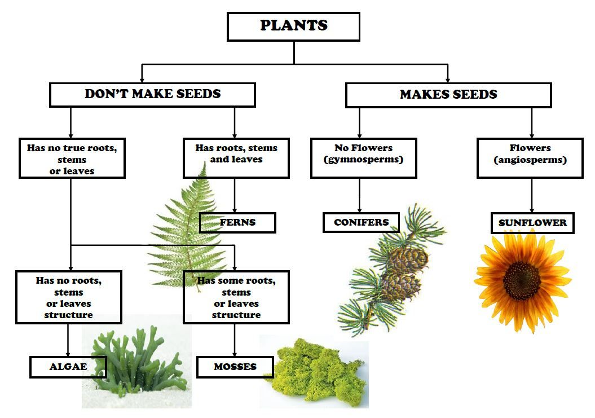

## Image Classicfication Project

Who during this Covid-19 lockdown didn't at some point wonder how bad things were going to get. Would we find ourselves in a post appocalyptic setting come some months of fallout? Would we become scavengers, roaming the wastes in search of the last remaining bits of resources that hadn't expired? How long could some of us survive, not knowing the difference between tea leaves and poison ivy... 

Well, I thought about it. I thought long and hard about survival if the worst were to happen, and though I consider myself a survivor, willing to make tough calls to eek out a living in a post-corona world, I could not tell you the difference between edible and non-edible foliage. 

Enter, my curious little passion project.

Here I am going to attempt to classify poisonous, edible, and non-edible plants using machine learning algorythims and photo recognition. This will be my first attempt at doing something like this but I am excited to find whether I use neural networks or some other program to label, train, and test my data. 

### Dataset

For this project I plan to use multiple datasets but confine my research to just plants and foliage found in Texas since this is hypothetically my would be stomping ground for any apocalyptic scenarios. 

https://texnat.tamu.edu/about/plant-identification/ 
https://hortsciences.tamu.edu/plantpicturepages/
http://www.npot.org/

I'll have to lookup how to make this happen. My computer is the little HP that could, so should these databases provide too many photos I will have to narrow it down to make it possible.

### Goal for 2021
:heart: Buy a Macbook Pro 
